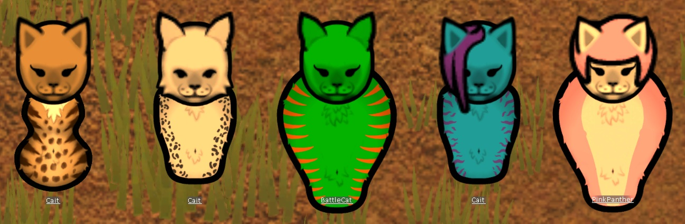

# Cheech Xenotype Mod
scradam and leetle ShawShaw's first attempt at making a xenotype fan club mod for their cats.

Inspired and based upon the Orassans mod by Diana (Kitty) Winters at https://steamcommunity.com/sharedfiles/filedetails/?id=1541519487  .

**Q:** Why are they called 'Cheech' or 'Cheechers'?  **A:** scradam and ShawShaw have brain damage. That's literally what they call cats IRL,    and now you probably will too. (Sorry.)

## Demo:

Here you can see we're attempting some new things by using pawn skin and hair color along with white and black to increase the readily available and configurable pawn texture palette.

## Garbage:

misc. commands scradam is keeping somewhere for reference:

mklink /J "C:\\Steam\\steamapps\\common\\RimWorld\\Mods\\CheechXenoType" "C:\\rw\\RimWorldCheech"
mklink /J "C:\\rw\\RimWorld" "C:\\Steam\\steamapps\\common\\RimWorld"
mklink /J "C:\\rw\\workshop" "C:\\Steam\\steamapps\\workshop\\content\\294100"
