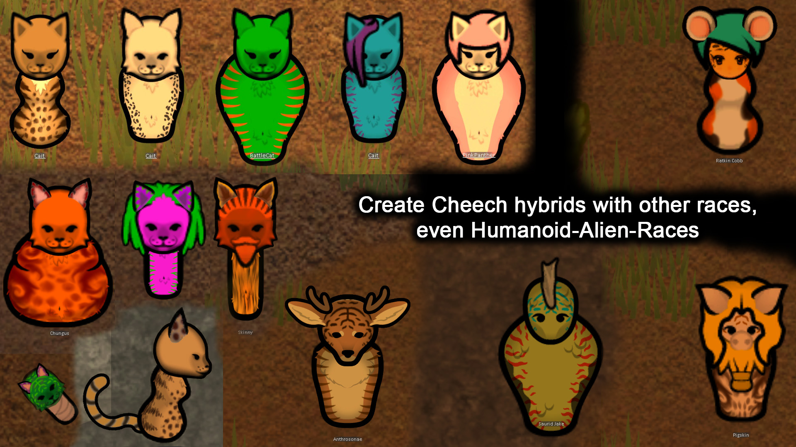
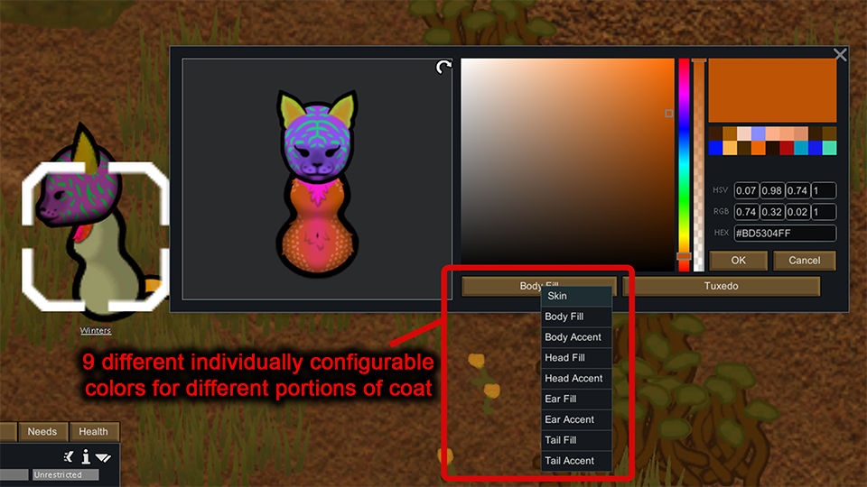
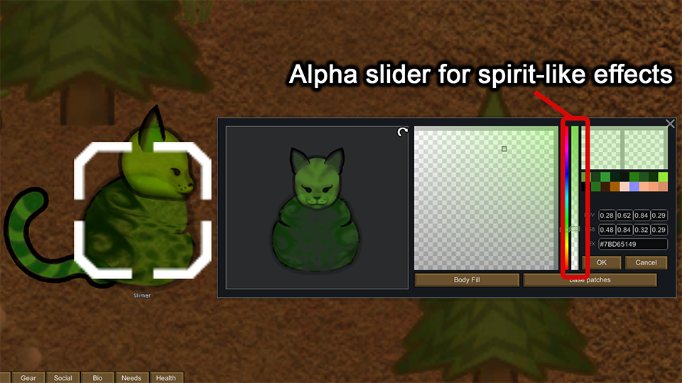
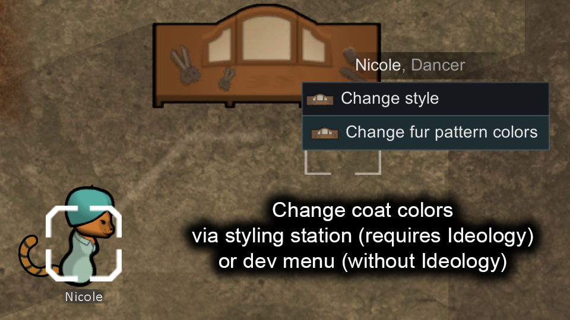

# [Cheech Xenotype Mod](https://steamcommunity.com/sharedfiles/filedetails/?id=3723106445)
[scradam](https://steamcommunity.com/id/scradam78) and [leetle ShawShaw](https://steamcommunity.com/profiles/76561198052992254)'s fan club mod for their cats. Inspired by and originally based upon the [Orassans mod](https://steamcommunity.com/sharedfiles/filedetails/?id=1541519487) by [Diana (Kitty) Winters](https://steamcommunity.com/profiles/76561198063663543).

## Features:
- Cat-like Xenotype with accompanying rough-outlander-type faction.
- All fur patterns are cosmetic-only genes. No game balance changes.
- Ability to individually color and pattern 9 different portions of the coat.
- Add fur coat patterns to other xenotypes. Once a pawn has at least one cheech fur pattern gene, they unlock the ability to color their fur at the styling station.
- Over 350 fur texture files in all.
- 15 different body pattern textures, supporting all body types (male, female, thin, fat, hulk, child):
    - 2 leopard patterns
    - 1 jaguar pattern
    - 2 mottled patterns
    - 2 patchy patterns
    - 1 spotty pattern
    - 5 different striped patterns
    - 1 swirl pattern
    - 1 tux pattern
- 7 face patterns to match the body patterns
- Only 1 tail pattern so far:
    - 1 striped pattern
- 4 ear patterns (all mediocre looking, at best):
    - 2 solid color patterns
    - 1 spotty pattern
    - 1 striped pattern

## Known issues:
- **Character Editor**: Adding and removing Cheech genes with Character editor is fine, but it's fiddly. Use the styling station to adjust costmetic Cheech genes if what you get via Character Editor doesn't look right.
- **Anthrosonae**: Anthrosonae uses a different color picker and system, and while the world view of Anthrosonae pawns looks fine with Cheech genes, scradam hasn't made time to render the Anthrosonae base coat properly via the Cheech color picker UI. Both pickers still seem to work okay, but you'll need to commit the color picker changes to see the effects properly.

## FAQ:
**Q:** Why are they called 'Cheech' or 'Cheechers'?
  **A:** scradam and ShawShaw have brain damage. That's literally what they call cats IRL, and now you probably will too. (Sorry.)
  **Q:** Is... is that a Litter Robot 5 as the O in Xenotype?
  **A:** Maybe. Or maybe it's a high-tech Cheech drop pod. Seriously though, Litter Robots are the best, and we recommend them for any cat owner that can afford one.
  **Q:** Why is the root namespace "Cheechin" in the C# code?
  **A:** That's what cheechers do. They cheech! They be cheechin' (slang for cheeching). When you use or work on this mod, you be cheechin' too.

## Demo:
Here you can see we're attempting some new things by using pawn skin and hair color along with white and black to increase the readily available and configurable pawn texture palette.

## Change Log:
- 0.3.0, 2026-05-30:
    - Added 5 more face accent patterns
    - Cheeches now occasionally spawn with hair, beards, and/or cheech-specific names
    - Non-combat-centric NPC cheeches spawn only with pants, in order to show off their coats
    - Tail offset fixes and jaguar face accent pattern fix
- 0.2.0, 2026-05-27:
    - Rewrote color picker UI
    - Added ability to swap coat pattern genes via color picker
- 0.1.0, 2026-05-24:
    - Initial Steam Workshop release

## Get your cat's name in this mod:
Would you like to see your cat memorialized, spawning as a trader or a raider to terrorize players for all of eternity!? Leave a comment with your late or current cat's name, asking us to insert it, and we'll add it to the next build. The name should be in the form of [Government Name (the one that is/was on file at the vet)] | [Nickname (the name you remember them and lovingly call/called them by)], e.g. "Mister Fluffington|Fluffy" or "Princess Purrsalot|Purrsi" or just "Fluffy" if their name/nickname are the same. Our current cat's names are "Stinkerbell|Steenk" and "Towanda|Tweeterpea", for example. Seeing our lost loved ones in RimWorld has been a huge source of joy for us. We want to extend that joy to everyone. 🥲

## Contributing:
If you just have ideas or requests, let us know in the comments. If you have cat-related textures you'd like us to add, please let us know! scradam can't particularly afford to pay for your textures, but he will surely credit you in the descriptions and summary here. If you'd like to contribute code, the github repo is public, so feel free to PR something, but maybe ask first if you're concerned about wasting effort on changes scradam won't approve.

## TODO / Ideas:
- Add remaining Orassans tail textures to game.
- Add remaining Orassans ear textures to game.
- Search for and beg other catlike-mod authors to let me use derivations of some of their textures to beef up variety further.
- Redo or augment name and coat pattern feature to allow players to submit an entirely custom cheech, modeled specifically after their cat.
- Add catnip as a crop. You could use the Orassans textures for it.
- Add Orrassans cat helmet textures to game.
- Add flame point base face pattern.
- Add cat-themed emotes like "tries to smell your breath" or "purrs loudly" or "gives you a head boop".
- Add litter-robot drop pod. It should accept 'cheech tirds' as fuel in addition to regular fuel.
- When butchering cheechers, make it such that it creates 'cheech meet', and there should be a special luxury dish named 'fried cheechers' that looks like a corndog, but it's a cat leg with a paw at the end.
- When butchering cheechers, it should create 'cheech pelt', and making furniture from it should have fur patterns.
- Add the 'chooler cooler' to the game that is both a passive coolor and a chair.
- Add a cat tree to the game that functions as a lookout tower, granting improved shot range and cover.
- Replace some paw icon usages with a litter robot icon.
- Improve XML descriptions, if for no other reason than to help Claude out.
- Changing fur color should require tincture flower stuff like normal color changes.
- Add XML-export feature to color picker to allow users to submit their custom themes for inclusion in the mod.
- Add more color schemes/themes.
- Figure out and deal with symbolPack, prefixSymbols, suffixSymbols on genes.
- Patches that make Cheechers want to eat lizard and rodent xenotypes.
- Figure out how the gradient hair mod works, particularly via character editor, and try to make that work for fur patterns.
- Add localization for popular languages.
- Make the Steam Workshop page fancier to help promote the mod.
- Make cheech muzzles colorable with a specific gene and part like the hog nose gene from Biotech.

## Acknowledgements:
- [Diana (Kitty) Winters](https://steamcommunity.com/profiles/76561198063663543): [Orassans](https://steamcommunity.com/sharedfiles/filedetails/?id=1541519487) textures and inspiration. 
- [Anthrosonae mod](https://steamcommunity.com/sharedfiles/filedetails/?id=2902258418) team: Color picker and gene binding example code. Red/green color texture masking examples.
- [VRE - Saurid mod](https://steamcommunity.com/sharedfiles/filedetails/?id=2880990495) team: Example for writing a Xenotype mod.
- [FluffierThanThou](https://github.com/FluffierThanThou): [Advanced color picker](https://github.com/fluffy-mods/ColourPicker) code.

## Special acknowledgement for [Diana (Kitty) Winters](https://steamcommunity.com/profiles/76561198063663543):
 Diana inspired me (scradam) to pick up the torch and write this mod, together with my wife, ShawShaw. A lot of people joke about all the war crimes and ridiculous atrocities we commit in RimWorld, but RimWorld and Diana's [Orassans](https://steamcommunity.com/sharedfiles/filedetails/?id=1541519487) mod in particular made for something truly wholesome as well. A few years ago, Diana's Orassans mod helped me through a particularly hard time in my life with the passing of my two elderly little girls (cats). After their passing, ShawShaw and I individually used [Character Editor](https://steamcommunity.com/workshop/filedetails/?id=1874644848) with Orassans as our cats to reassemble our family as our starting parties. Instead of dwelling on our late cats' deteriorating health and ultimately their loss, we made them undying, bionic, skilled leaders, counselors, doctors, traders, and raider-killing super soldiers in game.

My wife and I both loved the ridiculous adventures we've been on with our lost loved ones, thanks to Diana. After we were well enough again to open our hearts to two new adoptions, we've brought our two new cats along too in our latest playthroughs. The six of us all working together, carving out settlements, adventuring, and committing war crimes together is epic.

This world (our real world) can be a tough place where it's easy to dwell on all the ugliness and bad things sometimes. Thank you, Diana, for helping create a place that makes me smile and helps me remember the good things (in RimWorld, of all places, right?!)

## AI Usage:
This project uses AI, and scradam makes a point of it because he respects consumer choice to avoid AI. scradam is an AI enthusiast, although scradam condemns fossil fuel usage for AI training. AI was used extensively to assist with coding. Trivial Photoshop AI features were used as well, sparingly. AI will probably be used extensively for localization and will be expanded to assist in other ways as AI evolves and as scradam learns to leverage AI in new, novel ways. Claude has been such a huge stepping-stone just for help with quickly analyzing RimWorld source code and sanity checking that what we're trying to do is the best way to go about it.

## Donations & Support:
If you can just say you like the mod in the comments, that would mean a lot. scradam and ShawShaw spent over a year, off and on, trying to get this mod working in their miniscule amounts of free time, so just knowing someone else likes it would be huge. Beyond that, donate to your favorite animal welfare charity or shelter, and if you want to do it in scradam or ShawShaw's honor, just tell us you did so. Humane treatment of animals is a cause very dear to scradam's heart, and if you can help there, it's a huge inspiration for scradam to continue work on this mod.

Animal cruelty:\
✅😊👍🌈 in RimWorld.\
🚫😭👎💀 in real life.

## 'Licensing':
If you want to re-use individual assets or code from this mod, no credit to scradam or ShawShaw is needed, although scradam requests you credit and ask permission of the original authors that we credited, where appropriate, since this mod is standing on their shoulders. e.g. Ask Diana if you want to use her Orassans textures. All of the code in this mod is basically written by scradam and Claude at this point, and you are free to use it as you like (MIT license) without any constraints or credit needed.

If you fork this mod and publish a new version to the Steam Workshop or elsewhere that does not use this mod as a dependency, scradam kindly requests that you name your fork something that does not denote your version is 'continued', 'upgraded', 'improved', or any other such terminology that implies your version is largely or wholy better than this version, without first obtaining scradam's express approval (because otherwise, why not just contribute to this existing version via the public github?).

#### Unacceptable Examples:
- Cheech Xenotype Continued
- Cheech Xenotype Enhanced
- Cheechers Plus
- Cheach Xenotype Redux
- Cheeches: The Next Generation
- Cheech Xenotype Reborn
- Cheech Xenotype: Now With More Cheech!

#### Acceptable Examples:
- Felinefolk 2 (based on Cheech Xenotype)
- Cheech Xenotype: Alternate Universe Edition
- Cheech Xenotype: Comic-style Remix
- Fur Patterns 2
- Cheech Xenotype (official/original author is a bastard)
