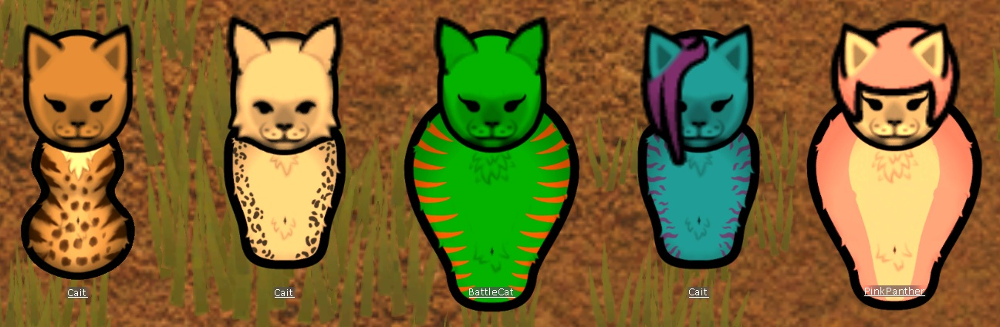
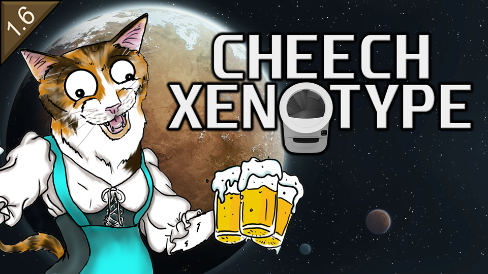

# Cheech Xenotype Mod
scradam and leetle ShawShaw's first attempt at making a xenotype fan club mod for their cats.

Inspired and based upon the Orassans mod by Diana (Kitty) Winters at https://steamcommunity.com/sharedfiles/filedetails/?id=1541519487  .

**Q:** Why are they called 'Cheech' or 'Cheechers'?
  **A:** scradam and ShawShaw have brain damage. That's literally what they call cats IRL, and now you probably will too. (Sorry.)
  **Q:** Why is the root namespace "Cheechin"?
  **A:** That's what cheechers do. They cheech! They be cheechin' (slang for cheeching). When you use or work on this mod, you be cheechin' too.

## Demo:

Here you can see we're attempting some new things by using pawn skin and hair color along with white and black to increase the readily available and configurable pawn texture palette.

## Must be done before Steam Workshop release:
- Fix cheech ear texture.
- Implement at least one patterened tail texture.
- Replace gene icons.
- Make sure XML has everything currently in the texture folders and clean up XML defs, etc.
- Credit Anthrosonae team for example code and color picker.
- Credit Diana (Kitty) Winters for Orassans mod and textures.
- Credit https://github.com/fluffy-mods/ColourPicker for the color picker code.
- Credit source mods in source code summaries once the code starts to stabilize for any other textures or code we're using.

## TODO / Ideas:
- Replace fat base coat with higher rez one based on Anthrosonae version.
- Figure out and fix bugs with rendering after adding and removing genes via character editor.
- Figure out and deal with symbolPack, prefixSymbols, suffixSymbols on genes.
- Figure out how to implement textures using red/green masks.
- Maybe ask Anthrosonae team if I can PR a variant of the Orassans textures.
- Put Meetch patterns into game.
- Put Tweater-pea patterns into game.
- Put Leetis patterns into game.
- Set prefab colors to the colors I like best for what we'd actually set for our leetle gurls.
- Go through z_samples folder and look for anything else good to put in game.
- Add more tails. TBD on how to implement stripes/spots and color patterns on tails. 
- Changing fur color should require tincture flower stuff like normal color changes.
- Custom names for faction/race members.
- Figure out how the gradient hair mod works, particularly via character editor, and try to make that work for fur patterns.
- Make patterns selectable via Pawn Editor mod.
- See if we can get alpha channel working for colors.
- Go through the ShaderDatabase class again and confirm if we're using the best shadrers for our purposes.

## Garbage:

misc. commands scradam is keeping somewhere for reference:

mklink /J "C:\\Steam\\steamapps\\common\\RimWorld\\Mods\\CheechXenoType" "C:\\rw\\RimWorldCheech"
mklink /J "C:\\rw\\RimWorld" "C:\\Steam\\steamapps\\common\\RimWorld"
mklink /J "C:\\rw\\workshop" "C:\\Steam\\steamapps\\workshop\\content\\294100"
